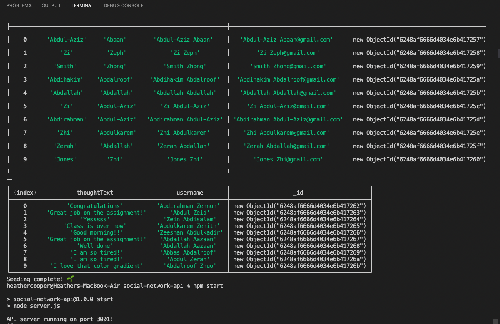
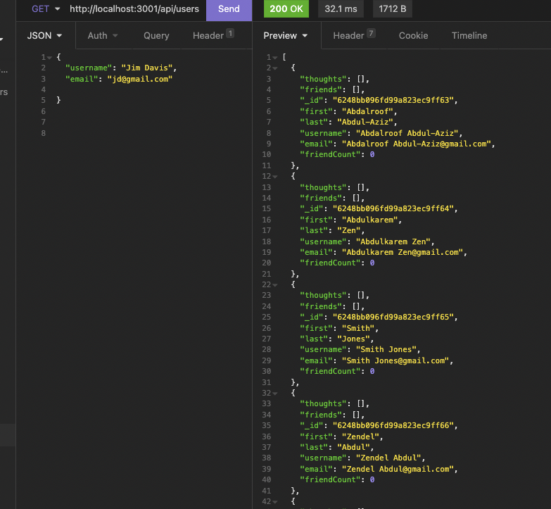
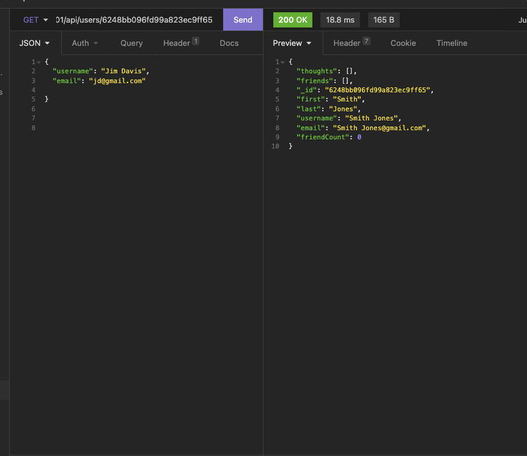
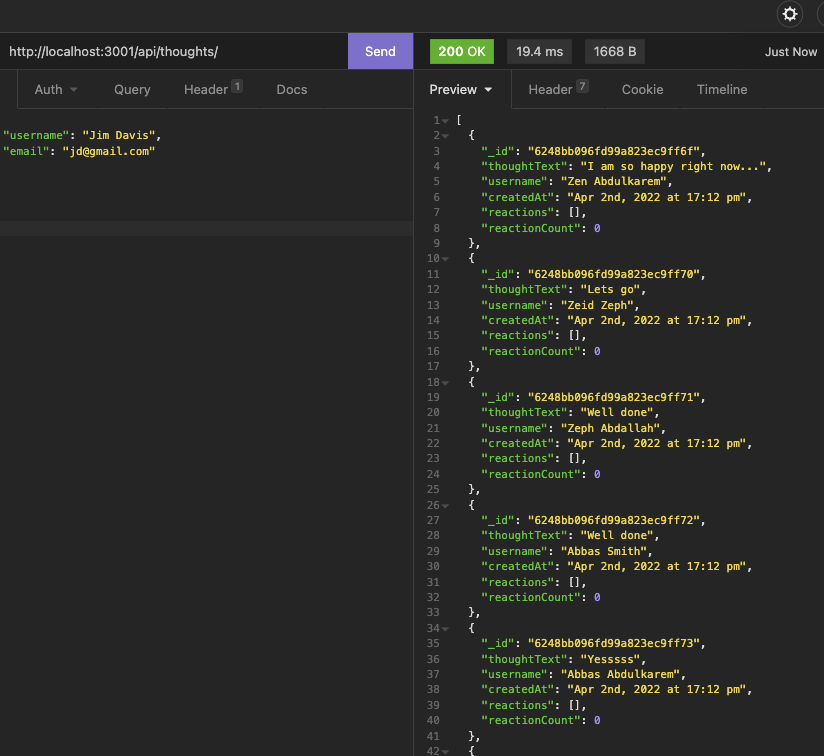
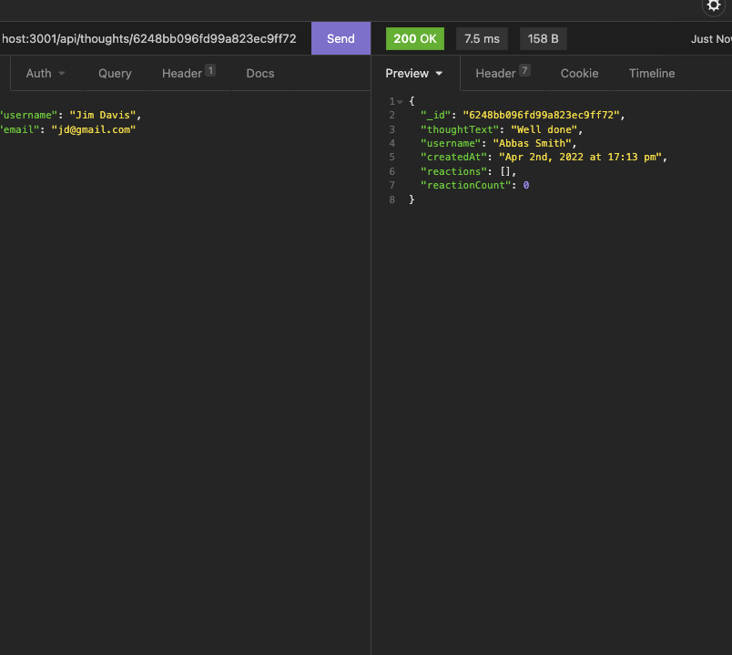

# social-network-api

### Description

This application is an API for a social network web application, using Express.js for routing, a MongoDB database, the Mongoose ODM and the native JavaScript Date object to format timestamps. 

Seed data was created using Insomnia.

---

### How to use:

From the command line, enter:
> npm run seed

After seeding, type: 
> npm run start

Open Application in the localhost at port 3001:
> http://localhost:3001

---

---

#### Technology Used

- Node.js
- Javascript
- Express.js
- MongoDB
- Mongoose
- MongoDB Compass
- Insomnia
  
---

#### Author

[cheribc](https://github.com/cheribc)

#### License

[MIT](https://opensource.org/licenses/MIT)
  